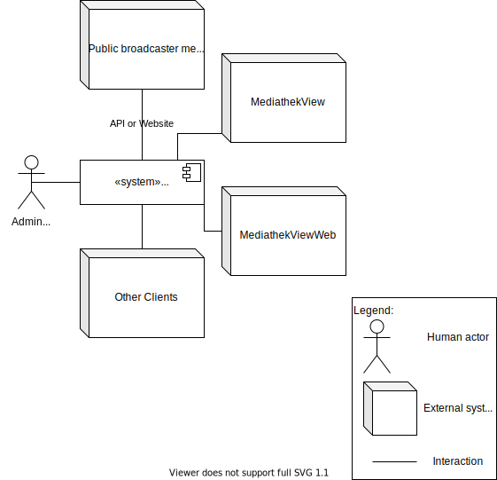

# Architecture Overview

MServer is a free open-source software that crawls the media libraries of the German-speaking public broadcasters and prepares them as a machine-readable list for clients such as [MediathekView](https://github.com/mediathekview/MediathekView).

## Table of Content

- [Architecture Overview](#architecture-overview)
  - [Table of Content](#table-of-content)
  - [Context](#context)
    - [Administrator (user)](#administrator-user)
    - [Public broadcaster media libaries (external system)](#public-broadcaster-media-libaries-external-system)
    - [MediathekView (external system)](#mediathekview-external-system)
    - [MediathekViewWeb (external system)](#mediathekviewweb-external-system)
    - [Other clients (external system)](#other-clients-external-system)
  - [Quality Goals](#quality-goals)
  - [Solution Strategy](#solution-strategy)
  - [Architectural Overview Diagram](#architectural-overview-diagram)

## Context

### Administrator (user)

The only real user of MServer is the administrator who configures and runs it.

### Public broadcaster media libaries (external system)

Each public broadcaster media libary is a own external system and needs it's own crawler. For some media libraries, no API exists, in which case the website itself is examined.

### MediathekView (external system)

[MediathekView](https://github.com/mediathekview/MediathekView) is the main supported client in the form of a desktop application.

### MediathekViewWeb (external system)

[MediathekViewWeb](https://github.com/mediathekview/MediathekViewWeb) is the second most important client in the form of a web application.

### Other clients (external system)

Other clients like [Zapp](https://github.com/mediathekview/zapp), [MediathekView Kodi Plugin](https://github.com/mediathekview/plugin.video.mediathekview) and other, often unkown, clients.

## Quality Goals

| Quality Goal                                    |                                                            Motivation/description |
| ----------------------------------------------- | --------------------------------------------------------------------------------: |
| Easy to configure and operate (Configurability) | For the administrator, it is very easy and quick to configure and operate MServer |
| Good performance  (Efficiency)                  |  The application runs very fast and uses the system resources as good as possible |
| Machine readable output (Interoperability)      |                      Results are machine-readable and easy for clients to consume |
| Good maintainability                            |               It's easy to change and adapt to the changes in the media libraries |
| Good reliability                                | It doesn't crash despite errors, but continues to run until its task is completed |

## Solution Strategy

| Quality Goal                                    |                                                                                                                                                                                                                                     Matching approaches in the solution |
| ----------------------------------------------- | ----------------------------------------------------------------------------------------------------------------------------------------------------------------------------------------------------------------------------------------------------------------------: |
| Easy to configure and operate (Configurability) |                                                                        <ul><li>A YAML configuration file for the entire application with overridable default values and comments in the configuration</li><li>Packaged as executable JAR and Docker container</li></ul> |
| Good performance  (Efficiency)                  |                                                                                                                                                                        Using the Java Fork/Join framework to run all crawlers at the same time and divide up their work |
| Machine readable output (Interoperability)      |                                                                                                                                                          The results can be saved as a normal JSON file or as the custom JSON-like legacy format used by the old server |
| Good maintainability                            | <ul><li>Each media library has its own crawler which is stored in its own package</li><li>The Java version and dependencies are kept up to date</li><li>Clean code is emphasized and checked via SonarQube</li><li>Every change is reviewed via a code review</li></ul> |
| Good reliability                                |                                                                                                                                                                                                   All exceptions are handled and none are passed through to the outside |

## Architectural Overview Diagram

